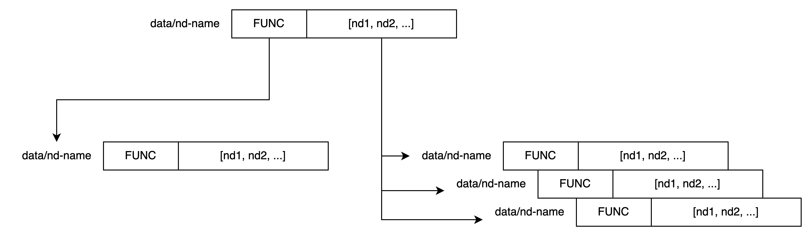

# Quality of Computation (QoC) ~~Named Tree~~

This project was evolved from course project for [Advanced Networked Systems](todo) lectured by Prof. [Dirk Kutscher](https://dirk-kutscher.info).

We identify that compuation quality (such as latency, throughput, and energy consumption) can not be guaranteed for emerging applications including Extended Reality (XR), Auto-driving (AD), etc. A mechanism should be designed to address this problem. This repo is a work-in-progress (WIP) proof-of-concept (PoC) implementation of the extension-base forwarder over ICN.

~~This is a novel name design in Named Function Networking (NFN). I name this design as it is architected as a BiTree where Ins, as function, is left node(subtree), and Data, as data,
is right node(subtree). We don't care what kind of data (function code or parameter data) you send or receive, users can combine them to implement their data transmission or computation flexibly.~~

## Links

* [Diagrams via Draw.io](https://app.diagrams.net/#G1nzmcPVBrSF1JE2lbRq35dAeH8vkFOqjQ)
* [WIP Paper Overleaf](https://www.overleaf.com/project/642da214b9f6e358612b8dc2)

## Update and RoadMap

At current stage, this project focuses on implementing a minimal proof-of-concept (PoC) program
to demonstrate the feasibility of the design. So there are several hypotheses and assumptions:

1. The network is reliable and stable.
2. The data security is not considered.
3. All nodes know the routing information.
4. No reward mechanism is considered.

### Todo

- [ ] Graph Implementation (not a tree anymore)
- [ ] Computation offloading strategy: whether should this node compute or forward?
- [ ] Routing protocol: how to find the next hop?
- [ ] Interest(name, data_name, func_name), func_name as an interest name

### 2023-08-16

- [x] Update README introduction.

### 2023-05-18

- [x] update forwarder architecture design: a diagram
- [x] remove redundant test code
- [x] add test cases

```
C1───────────F1-cs-nf────────────F3-cs-nf────────────F5-cs
             │                   │                   │
             │                   │                   │
             │                   │                   │
             │                   │                   │
             │                   │                   │
             │                   │                   │
             F2-cs───────────────F4-cs-nf────────────┘

```

### 2023-05-17

- [x] Content Store implemented as an extension and its test case
- [x] Interest datastructure: (name) -> (name, data_name, func_name)
- [x] nfn-extension: computing NFN interest and its test case
- [x] Simulator abstraction
- [x] Test loading from yaml config file

### 2023-05-16

- [x] extension mechanism for forwarder

### 2023-05-15

- [x] Routing center, mocked routing and test case
- [x] Node generator and initializer (generate a network and distribute tasks)

```
             C2
             │
             │
             │
C1────F4─────F1──────F2─────P1
             │
             │
             F3
             │
             │
             │
             P2
```

### 2023-05-14

- [x] add Class Provider
- [x] add more test cases
    - consumer-to-forwarder
    - consumer-to-forwarder-to-provider
    - line-shape: 2 forwarders

test cases:

```
1.
               Interest
     ┌──────────┬ ──────────►┌───────────┐
     │ Consumer │            │ Forwarder │
     └──────────┘◄────────── ┴───────────┘
                     Data

2.
                 Interest               Interest
    ┌──────────┬ ──────────►┌───────────┬ ─────►┌──────────┐
    │ Consumer1│            │ Forwarder1│       │ Provider1│
    └──────────┘◄────────── ┴───────────┘◄───── ┴──────────┘
                    Data                 Data
3.
                  Interest                Interest                 Interest
    ┌──────────┐ ─────────► ┌──────────┐ ─────────► ┌───────────┐ ─────────► ┌──────────┐
    │ Consumer │            │ Forarder │            │ Forwarder │            │ Provider │
    └──────────┘ ◄───────── └──────────┘ ◄───────── └───────────┘ ◄───────── └──────────┘
                    Data                    Data                     Data
```

### 2023-05-12

- [x] add Forwarder class
- [x] add Consumer class
- [x] add consumer-to-forwarder test case: test_forwarder.py

### 2023/4/28

- [x] a python class to abstract `Named Data (ND)`
- [x] simple recursive execution
- [x] implement the tree as a multiway tree for performance, because the **depth determines the
  performance of the whole system**
- [x] init project
- [x] write simple shell for concept demo

## Design

This repo is mainly an implementation of a forwarder, 
the architecture of this forwarder please refer to [this file](https://github.com/ViGeng/named-tree/blob/forwarder/forwarder-design.svg)

NamedData class consists of two parts: `FUNC` and `DATA`.
FUNC is a function, and DATA is list.

